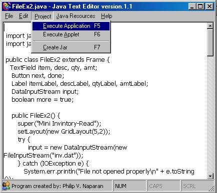

## \_Java Text Editor

### Description

HELLO FREINDS! I'VE CREATED THIS JAVA TEXT EDITOR FOR ME AND FOR YOU TO CREATE PROGRAM IN JAVA FASTER AND EASY. THIS JAVA TEXT EDITOR CAN COMPILE, RUN, AND MAKE YOUR JAVA CODE .JAR .IT ALSO HAVE THE ABILITY TO RUN AND EXECUTE JAVA APPLET. PLS. DONT FORGET TO VOTE AND GOD BLESS YOU ALL!!!!!!!!!!!!!!
 
### More Info
 

             |
---                |---
**Submitted On**   |2003-08-25 16:04:10
**By**             |[Philip  V\. Naparan :\-\)](https://github.com/Planet-Source-Code/PSCIndex/blob/master/ByAuthor/philip-v-naparan.md)
**Level**          |Advanced
**User Rating**    |4.3 (39 globes from 9 users)
**Compatibility**  |VB 3\.0, VB 4\.0 \(16\-bit\), VB 4\.0 \(32\-bit\), VB 5\.0, VB 6\.0
**Category**       |[Complete Applications](https://github.com/Planet-Source-Code/PSCIndex/blob/master/ByCategory/complete-applications__1-27.md)
**World**          |[Visual Basic](https://github.com/Planet-Source-Code/PSCIndex/blob/master/ByWorld/visual-basic.md)
**Archive File**   |[\_Java\_Text164074942003\.zip](https://github.com/Planet-Source-Code/philip-v-naparan-java-text-editor__1-48238/archive/master.zip)

